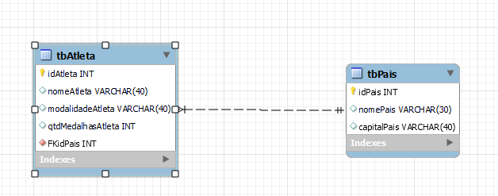
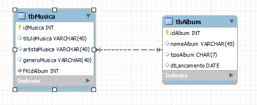

## MySQL
    > Nesse repositório foi utilizado inner join, junto com AS que serve para renomear.
    > Também foi realizado o mer com relacionamento e cardinalidade.

### Mer Atleta:

### Mer Musica:

* <b>Conceitos Usados:</b> DDL e DML. 